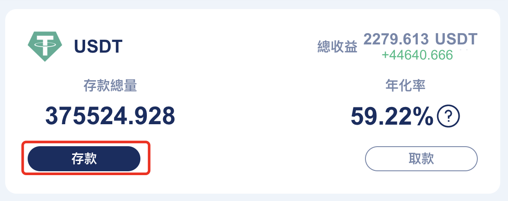
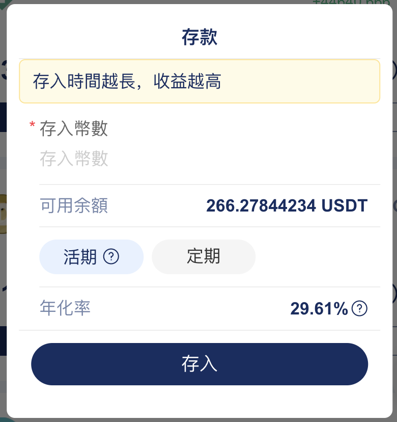

# 存款教程

打開網站後，點擊“存款”，按鈕\
\

彈出的存款，輸入存款數量和存款類型，類型分爲二種，活期（隨存隨取）、自定義（固定存一段時間，期間不可取，收益高）


<mark style="color:orange;background-color:purple;">`注意：第一次存款，需要授权，權成功後就可以存入了`</mark>


<mark style="color:orange;background-color:yellow;">``</mark><mark style="color:orange;background-color:yellow;">\`\`</mark>

點擊“存入”按鈕“，確認後存款完成，每天等分收益就可以了，不想玩的時候，就可以”解鎖“ -> ”取款“。
